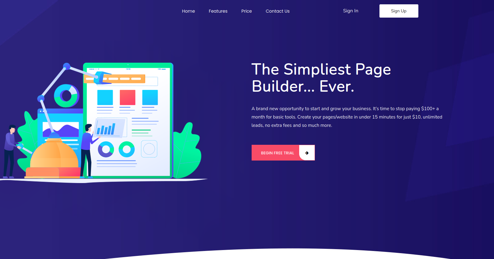

<header class="header-tops" id="header">

# [Kshitij Sharma](/)

## I'm a passionate full stack developer from Himachal Pradesh

<nav class="nav-menu d-none d-lg-block">

*   [Home](#header)
*   [About](#about)
*   [Resume](#resume)
*   [Services](#services)
*   [Portfolio](#portfolio)
*   [Contact](#contact)

</nav>

</header>

<section class="about" id="about">

## About

Learn more about me

### Full Stack Developer

I am just a developer who love to create simple and beautiful systems. I like challenges so that's why I am in love with what I do.

*   **Birthday:** 24 Apr 1991*   **Website:** https://kshitjportfolio.herokuapp.com*   **Phone:** +91 8262853885*   **City:** City : Shimla, India

*   **Age:** 30*   **Degree:** B.Tech*   **PhEmailone:** kshtjsharma68@gmail.com*   **Freelance:** Available

I am a system architect who enjoys playing with system nodes and accomplish a task with simplicity.

232

Happy Clients

60

Projects

12000

Hours Of Work

15

Teams

## Skills

HTML _90%_

CSS _80%_

JavaScript / jQuery_90%_

Bootstrap _90%_

PHP ( Laravel / Lumen )_90%_

Nodejs ( Express ) _80%_

Mysql _80%_

React _90%_

## Interests

### Reading

### Listening Music

### Hiking

### painting

### Development

### Photography

### Drawing

### Cycling

### Ukulele

### Gardening

</section>

<section class="resume" id="resume">

## Resume

Check My Resume

### Summary

#### Kshitij Sharma

Innovative and deadline-driven Full stack developer with 5+ years of experience designing and developing simple and strong from initial concept to final, polished deliverable systems.

*   Zasya Solutions, Shimla INDIA
*   +91 82628-53885
*   kshtjsharma68@gmail.com

### Education

#### Post Graduate Diploma In Computer Science

##### 2013 - 2014

_NIIT Hamirpur_

Basic to Advance course which envolves introduction to system structure, pragramming languages, data structure, compiler and interpreter and many more.

#### Bachelor of Technology Electronics & Communication

##### 2008 - 2012

_Rayat & Bahra Institute of Engineering & technology Hoshiarpur_

Advance knowledge of basic concepts of technologies and real world issues. Understanding of how to approach a problem and resolve it maximum risk management. Able to understand how information flow works and how data systems are designed. Approach to tackle the problem and reach the root before trying to solve it.

### Professional Experience

#### Backend Developer

##### 2015 - 2017

_Zasya Solutions, Shimla, INDIA_

*   Lead in the design, development, and implementation of the backend structure and creating a system to communicate with database and other api's with efficiency for various products
*   Delegate tasks to manage payments, orders and transactions.
*   Supervise the flexibility and optimised performance of the system like data transfer, UI interations and query operations
*   Oversee the efficient use of production project budgets

#### Javascript and Laravel Developer

##### 2017 - 2019

_Zasya Solutions, Shimla, INDIA_

*   Developed numerous programs ranging from UI based tasks to full backend operations.
*   Managed up to 4 projects or tasks at a given time while under pressure
*   Recommended and consulted with clients on the most appropriate system architecture and best UX.
*   Created numerous systems having simple architecture and vast operations like twilio based system, blockchain based system and many more..

#### Full Stack Developer

##### 2019 - Present

_Zasya Solutions, Shimla, INDIA_

*   Handled total Management of projects from UI design to full system architecture keeping happy clients in loop.
*   Team management and task handling keeping deadline in mind using tools like JIRA, ClickUp ...
*   Worked on projects using multiple frameworks like React, Lumen, ExpressJs
*   My Goal is to provide good and simple product with flexible architecture & fast & optimised operations

</section>

<section class="services" id="services">

## Services

My Services

#### [HTML](javascript:void(0);)

Markup language used for structuring and presenting content on the World Wide Web

#### [CSS](javascript:void(0);)

Style sheet language used for describing the presentation of a document written in a markup language

#### [TAILWIND](javascript:void(0);)

A utility-first CSS framework for rapidly building custom user interfaces

#### [BOOTSTRAP](javascript:void(0);)

Free and open-source CSS framework directed at responsive, mobile-first front-end web development.

#### [JAVASCRIPT](javascript:void(0);)

Text-based programming language used both on the client-side and server-side that allows you to make web pages interactive

#### [JQUERY](javascript:void(0);)

JavaScript library designed to simplify HTML DOM tree traversal and manipulation

#### [REACT](javascript:void(0);)

Free and open-source front-end JavaScript library for building user interfaces or UI components

#### [REDUX SAGA](javascript:void(0);)

Middleware library used to allow a Redux store to interact with resources outside of itself asynchronously

#### [PHP](javascript:void(0);)

A general-purpose scripting language geared towards web development.

#### [LARAVEL](javascript:void(0);)

Open-source PHP web framework intended for the development of web applications following the model–view–controller architectural pattern

#### [LUMEN](javascript:void(0);)

Micro framework used to build for microservices with loosely coupled components that reduce complexity and enhance the improvements easily.

#### [NODEJS](javascript:void(0);)

AN open-source, cross-platform, back-end JavaScript runtime environment that runs on the V8 engine

#### [EXPRESSJS](javascript:void(0);)

A back end web application framework for Node.js for building web applications and APIs

#### [DOCKER](javascript:void(0);)

A set of platform as a service products that use OS-level virtualization to deliver software in packages called containers

#### [TWILIO](javascript:void(0);)

platform to programmatically make and receive phone calls, send and receive text messages, and perform other communication functions using its web service APIs

#### [MYSQL](javascript:void(0);)

An open-source relational database management system

#### [GIT](javascript:void(0);)

Software for tracking changes in any set of files, usually used for coordinating work

#### [MAILCHIMP](javascript:void(0);)

Automation platform and email marketing service

#### [PIPEDRIVE](javascript:void(0);)

A deal-driven customer relationship management CRM solution that also works as an account-management tool

</section>

<section class="portfolio" id="portfolio">

## Portfolio

My Works

*   All
*   Laravel
*   Twilio
*   React / Javascript
*   Webflow

#### Beadclub

Laravel

#### KitCheck

Laravel

#### Anasa Psychics

Laravel

#### Anasa Psychics

Twilio

#### SPP

Laravel

#### Biramedia

Laravel

#### Biramedia

React

#### AltSignals

Laravel

#### AltSignals

Webflow

#### Mobile Car Wash

Laravel

#### Mobile Car Wash

React

#### DialExcel

Twilio

#### DialExcel

Laravel

#### Spectage

Laravel

#### Spectage

React

</section>

<section class="contact" id="contact">

## Contact

Contact Me

### My Address

Zasya solutions, kasumpti Shimla, India 171009

### Social Profiles

### Email Me

kshtjsharma68@gmail.com

### Call Me

+91 8262853885

<form class="php-email-form mt-4" action="/forms/contact" method="post" role="form"><input type="hidden" name="_csrf" value="ReF25MCc-VaGArzUD4dy4fPNrYrtuGIhhbfM">

<input class="form-control" id="name" type="text" name="name" placeholder="Your Name" data-rule="minlen:4" data-msg="Please enter at least 4 chars">

<input class="form-control" id="email" type="email" name="email" placeholder="Your Email" data-rule="email" data-msg="Please enter a valid email">

<input class="form-control" id="subject" type="text" name="subject" placeholder="Subject" data-rule="minlen:4" data-msg="Please enter at least 8 chars of subject">

<textarea class="form-control" name="message" rows="5" data-rule="required" data-msg="Please write something for us" placeholder="Message"></textarea>

Loading

Your message has been sent. Thank you!

<button type="submit">Send Message</button>

</form>

</section>